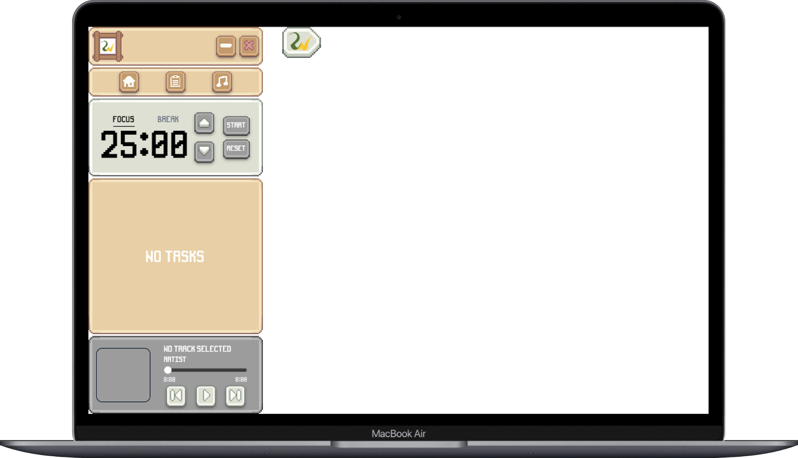
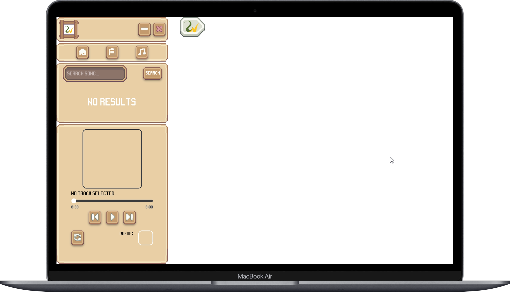

# Windzy

A cozy and lightweight desktop music player built for a simple listening experience.

## Features

- 🎵 Search and play music
- 📃 Queue management
- 🔀 Random recommendations
- ⏯️ Play, pause, skip controls
- 💻 Lightweight desktop application
- 🎨 Clean and cozy interface

## Screenshots

## Download

➡️ **[Latest Release](https://drive.google.com/file/d/1lpN6tca43xRK0bcUCAcHH4uC_rJ2PCmc/view?usp=sharing)**

## Installation

### Windows

1. Download the latest ZIP from the Releases page.
2. Extract the ZIP.
3. Run `Windzy.exe`.

No installation required.

## Tech Stack

- React
- TypeScript
- Tailwind CSS
- Python
- Flask
- Electron

## Contributing

Contributions, issues, and feature requests are welcome.

## License

MIT License

---

Made with ❤️ by Iber Studio.
